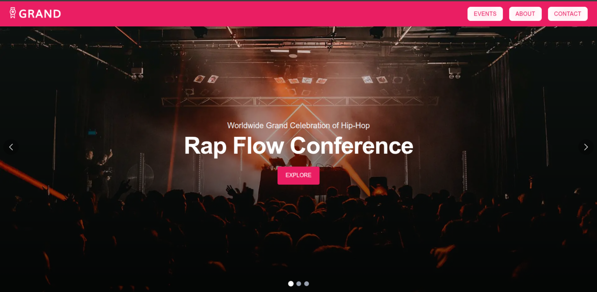
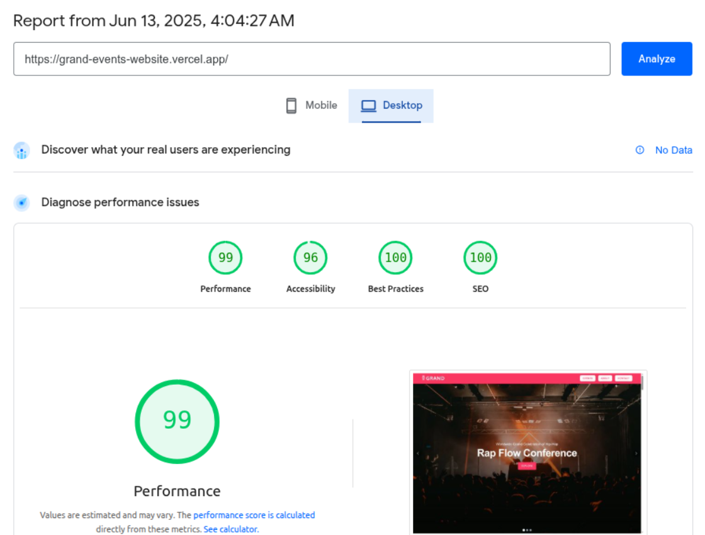
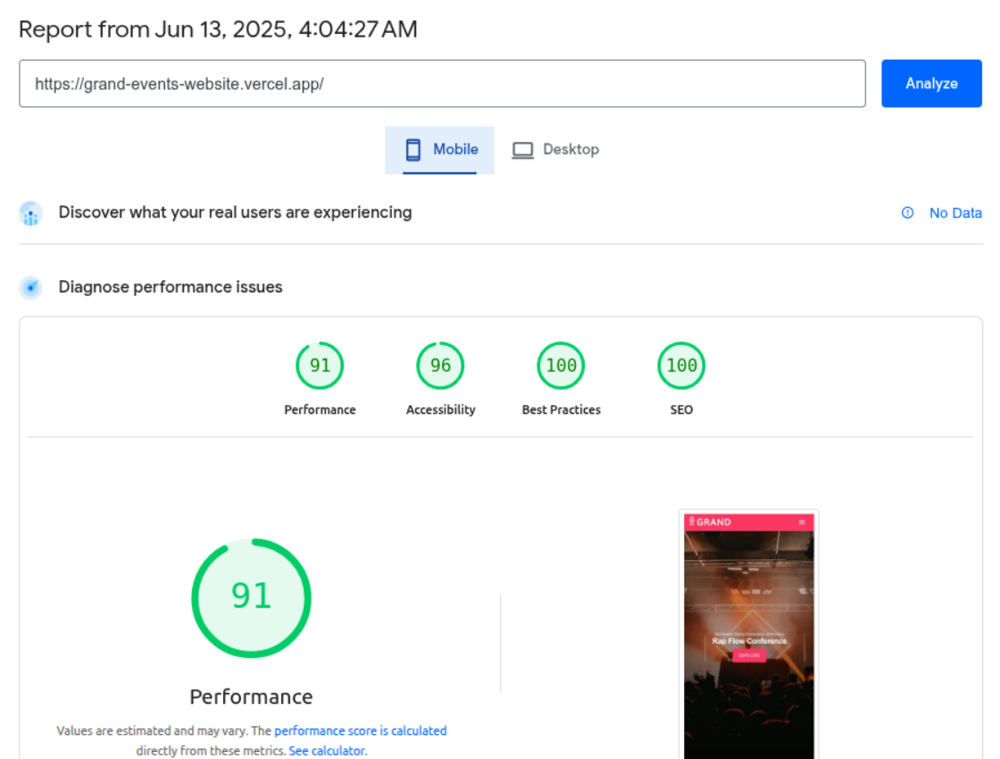

  <h1>🎉 Grand Events - Web Application</h1>
  
A modern events web platform built with <strong>Next.js 15</strong> and <strong>Material UI v6</strong>. It offers a clean user interface and responsive design for event listings, company info, and contact forms.

  

    <h2>🚀 Technologies Used</h2>
    <ul>
      <li>Next.js 15 (Turbopack)</li>
      <li>React 18</li>
      <li>Material UI v6 (MUI System, AppBar, Grid v2)</li>
      <li>Tailwind CSS (partially)</li>
      <li>Next Image Optimization</li>
    </ul>
  

## 📸 First Screen (UI)

## ⚡ Performance Report

  

    <h2>🛠️ How to Run Locally</h2>
    <pre><code>git clone https://github.com/yourusername/grand-events.git
cd grand-events
npm install
npm run dev</code></pre>
    
Then open <code>http://localhost:3000</code> in your browser.

  

  

    <h2>📂 Folder Structure</h2>
    <pre><code>.
├── components/
├── pages/
├── public/
│   └── img/
├── styles/
├── next.config.mjs
└── README.html</code></pre>
  

  <footer>
    
Made with ❤️ by Your Name

  </footer>
